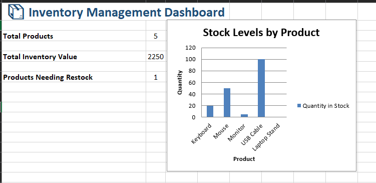

# Inventory Management System (Excel Project)

## 📦 Project Overview

This project is a simple and effective **Inventory Management System** built using **Microsoft Excel**.  
It is designed to help users track their products, stock levels, reorder needs, and inventory value in an organized and visual way — without requiring complex software.

The system includes:
- Automated stock level tracking
- Conditional formatting to highlight low-stock products
- Data validation to ensure correct inputs
- A dashboard summarizing total items, inventory value, and alerts
- Dynamic filtering for easy search

---

## 🚀 How to Use

1. **Product Entry**:  
   Add new products in the **Inventory Table** by filling in:
   - Product ID
   - Product Name
   - Category
   - Supplier
   - Unit Price
   - Quantity in Stock
   - Reorder Level (minimum safe quantity)

2. **Stock Updates**:  
   Update the "Quantity in Stock" column as inventory moves (sales, purchases, or returns).

3. **Alerts**:  
   Items that fall below the "Reorder Level" are automatically highlighted in red, signaling that restocking is needed.

4. **Dashboard View**:  
   View the dashboard to monitor:
   - Total products
   - Total inventory value
   - Number of products needing restocking

---

## 📊 Features

| Feature                 | Description                                           |
|--------------------------|-------------------------------------------------------|
| **Conditional Formatting** | Automatically highlights low-stock items             |
| **Formulas**               | Calculates total inventory value automatically       |
| **Data Validation**        | Prevents incorrect data entry (e.g., text in number fields) |
| **Dynamic Dashboard**      | Summarizes key inventory metrics and warnings         |
| **Filter/Search**          | Quickly find products by name, category, or supplier |

---

## 🛠️ Technical Details

- **Excel Functions Used**:  
  `SUM`, `IF`, `COUNTIF`, `VLOOKUP`, `FILTER`, basic math operations.
  
- **Design Tools**:  
  - Excel Tables
  - Named Ranges
  - Conditional Formatting
  - PivotTables (for optional advanced dashboards)
  

## ✨ Screenshots

